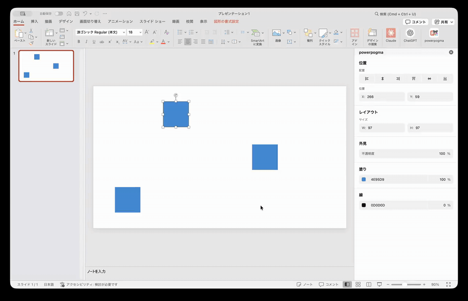

<p align="center">
  
</p>

<h1 align="center">powerpogma</h1>

<p align="center">
  A Figma-like inspector panel for editing PowerPoint shapes.
</p>

<p align="center">
  <a href="./README.md">日本語</a>
  ·
  <strong>English</strong>
</p>

<p align="center">
  <a href="https://monjofight.github.io/powerpogma/src/taskpane.html">Taskpane</a>
  ·
  <a href="https://github.com/monjofight/powerpogma/raw/main/manifest.xml">Download manifest.xml</a>
  ·
  <a href="#install-on-powerpoint-for-mac">Install on Mac</a>
</p>

`powerpogma` is an Office Add-in that lets you edit PowerPoint shapes from a Figma-like inspector pane.

The task pane is hosted on GitHub Pages, so normal usage does not require running a local server.

## Demo



## Features

- Figma-like inspector UI inside a PowerPoint task pane
- Real-time updates for selected shapes
- Position editing: `X`, `Y`
- Size editing: `W`, `H`
- Align left, horizontal center, align right, align top, vertical center, align bottom
- Fill color and fill opacity
- Line color and line opacity
- Mixed-value display for multi-selection
- Horizontal and vertical spacing controls for multi-selection
- Select-all input behavior and arrow-key value stepping

## Install On PowerPoint For Mac

These steps are for **PowerPoint for Mac**.

### 1. Download manifest.xml

Download this file:

[manifest.xml](https://github.com/monjofight/powerpogma/raw/main/manifest.xml)

### 2. Quit PowerPoint

Quit PowerPoint completely.

### 3. Place manifest.xml in the wef folder

Run this in Terminal if the downloaded file is named `manifest.xml`:

```bash
mkdir -p ~/Library/Containers/com.microsoft.Powerpoint/Data/Documents/wef
cp ~/Downloads/manifest.xml ~/Library/Containers/com.microsoft.Powerpoint/Data/Documents/wef/7f4b4b6a-31c8-42da-b9f8-cb6d558c4f31.manifest.xml
```

Alternatively, you can place it directly without downloading it first:

```bash
mkdir -p ~/Library/Containers/com.microsoft.Powerpoint/Data/Documents/wef
curl -L https://github.com/monjofight/powerpogma/raw/main/manifest.xml \
  -o ~/Library/Containers/com.microsoft.Powerpoint/Data/Documents/wef/7f4b4b6a-31c8-42da-b9f8-cb6d558c4f31.manifest.xml
```

### 4. Open PowerPoint

Open PowerPoint and open any presentation.

### 5. Open powerpogma

Use the ribbon menu:

```text
Home > Add-ins > More Add-ins > Developer Add-ins > powerpogma
```

Select `powerpogma` to open the task pane on the right.

## Important

Do not use `Tools > PowerPoint Add-ins`.

That dialog is for the legacy PowerPoint add-in format, and it may not allow selecting an Office.js `manifest.xml`. Open `powerpogma` from `Home > Add-ins` instead.

## Uninstall On PowerPoint For Mac

Quit PowerPoint, then run:

```bash
rm -f ~/Library/Containers/com.microsoft.Powerpoint/Data/Documents/wef/7f4b4b6a-31c8-42da-b9f8-cb6d558c4f31.manifest.xml
```

Restart PowerPoint after removing the manifest.

## Development

Node.js is only required for development and validation.

```bash
npm install
npm run validate
```

To preview the task pane locally, start the HTTPS server:

```bash
npm run start
```

Normal PowerPoint usage does not require `npm run start`, because `manifest.xml` points to the GitHub Pages-hosted task pane.

## Sideload With Office Add-in Tooling

You can also sideload the add-in directly with Office Add-in tooling:

```bash
npx --yes office-addin-debugging start manifest.xml desktop --app powerpoint --no-debug
```

This also does not require running a local server. The manifest loads the task pane from GitHub Pages.

## Project Structure

```text
assets/          Add-in icons
src/             Taskpane HTML/CSS/JavaScript
manifest.xml     Office Add-in manifest
server.mjs       Local HTTPS static server for development
PUBLISHING.md    Publishing notes
```

## Notes

- Taskpane URL: https://monjofight.github.io/powerpogma/src/taskpane.html
- Repository: https://github.com/monjofight/powerpogma
- The add-in works within the shape-property range supported by the PowerPoint JavaScript API.
- Not every PowerPoint object type or advanced visual effect is supported.

## License

MIT
